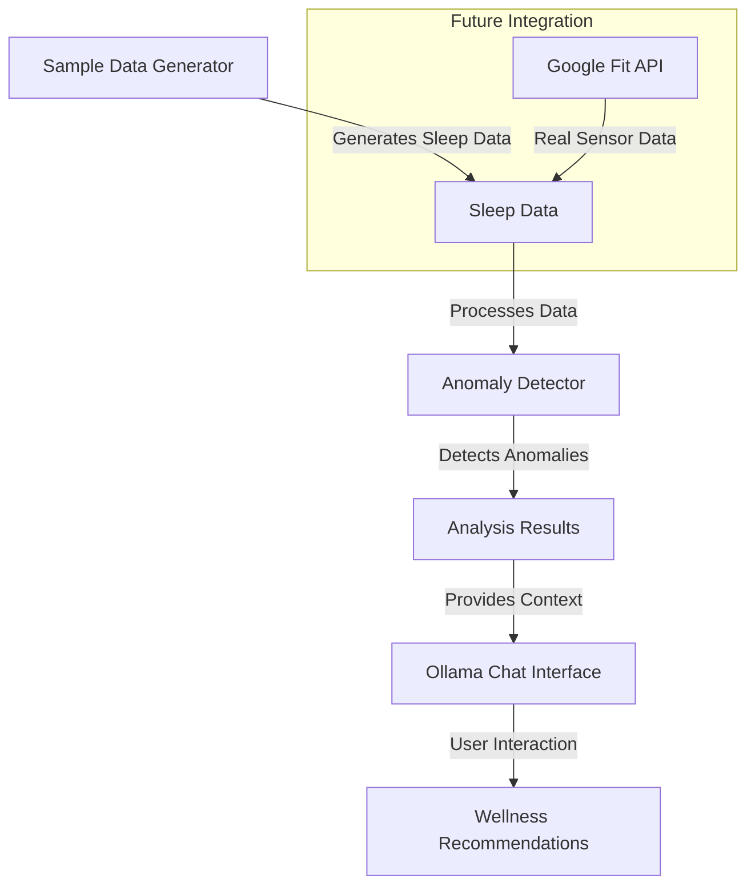

# WellnessBuddy

WellnessBuddy is an AI-powered wellness application that monitors health data, detects anomalies, and provides personalized recommendations through an interactive chat interface. The application currently focuses on sleep pattern analysis but is designed to be extensible to other health metrics.

## Features

- Sleep pattern monitoring and analysis
- Anomaly detection in sleep data
- Interactive AI chat interface using Ollama
- Sample data generation for testing and development
- Google Fit API integration (`almost` ready for real sensor data)

## Architecture



## Prerequisites

- Python 3.11 or higher
- Ollama installed and running locally
- (Optional) Google Fit API credentials for real sensor data
- uv package manager

## Installation

1. Clone the repository:
```bash
git clone https://github.com/yourusername/WellnessBuddy.git
cd WellnessBuddy
```

2. Install dependencies using uv:
```bash
uv pip install -e .
```

3. Set up environment variables 
Copy .env.example content to your `.env` file and modify it respecting the instructions

## Usage

1. Run the main application:
```bash
uv run main.py
```

2. The application will:
   - Generate sample sleep data
        - Adds anomalies to it
   - Detect anomalies in the data
        - Based on the average of the past days and defined threshold
   - Start an interactive chat session with Ollama
        - Provide wellness recommendations based on the analysis
        - Chat with the model

3. To exit the chat, type "quit" when prompted.

## Project Structure

```
WellnessBuddy/
├── main.py
├── src/
│   ├── models/
│   │   ├── anomaly_detector.py
│   │   └── ollama_client.py
│   ├── apis/
│   │   └── googleFitAPI.py
│   └── utils/
│       └── sample_data_generator.py
└── README.md
```

## Current Implementation

The current implementation uses sample data generation instead of real sensor data. This allows for:
- Testing and development without actual sensor hardware
- Controlled anomaly injection for testing
- Consistent data structure matching the Google Fit API format

## Future Enhancements

- Integration with real sensor data through Google Fit API
- Support for additional health metrics
- Enhanced anomaly detection algorithms
- More sophisticated AI recommendations
- User authentication and data persistence
